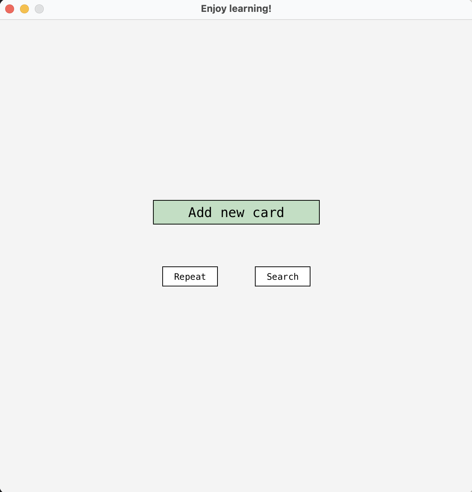
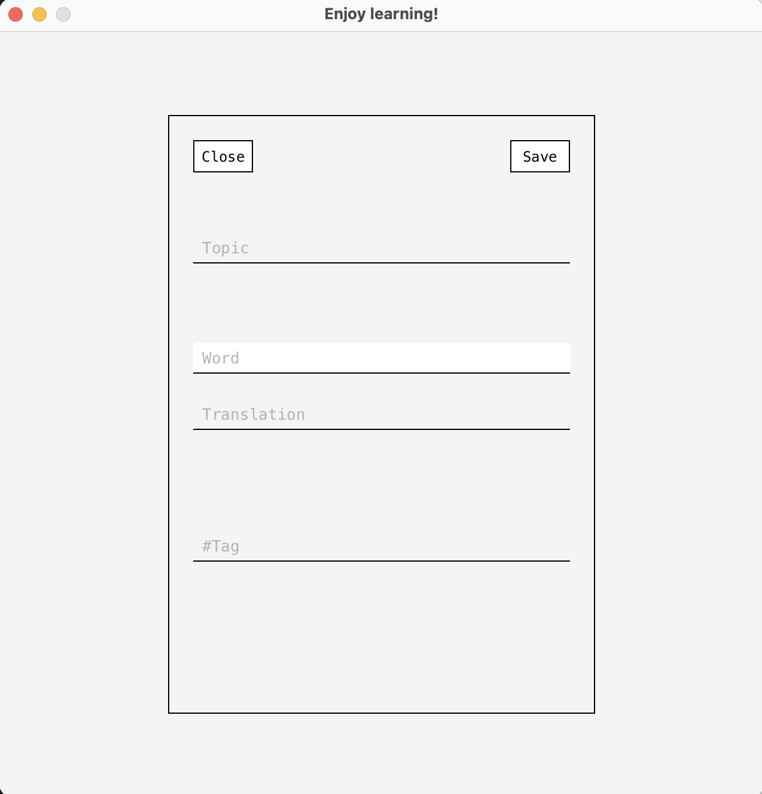
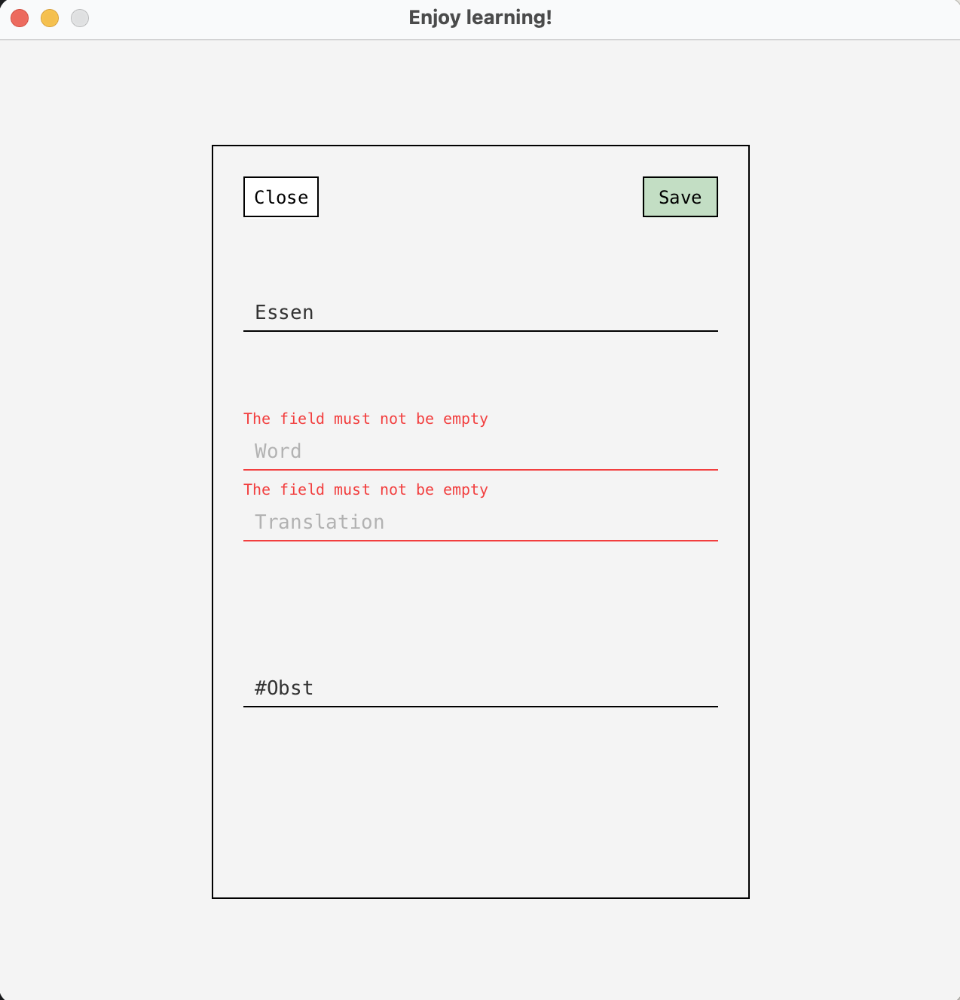
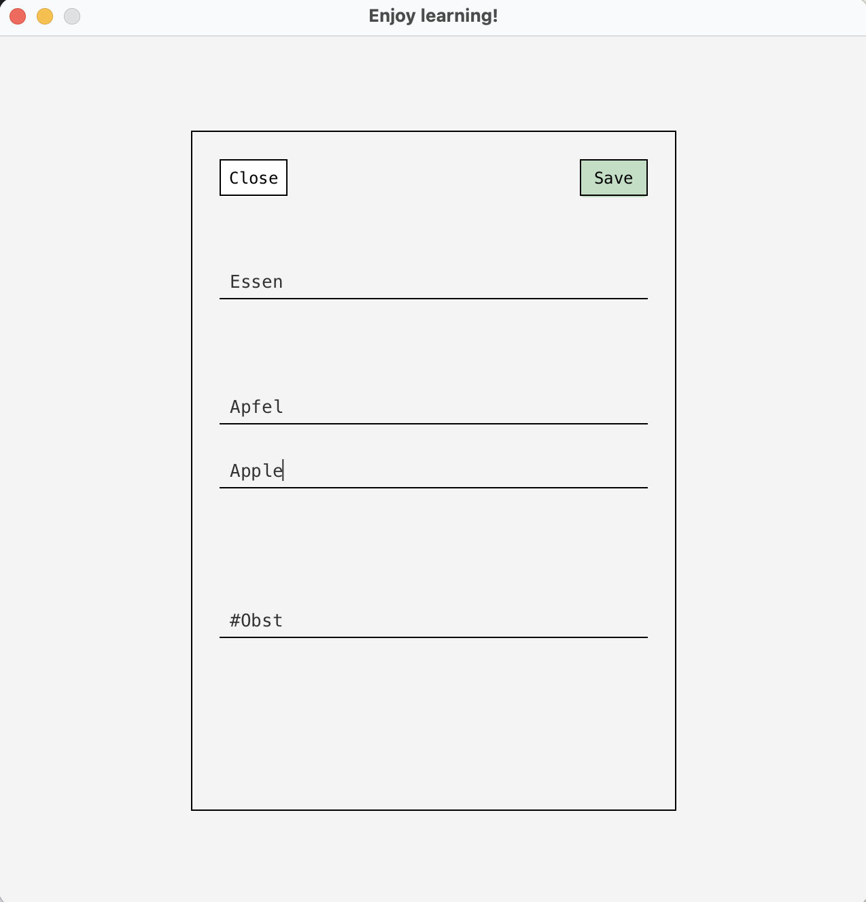
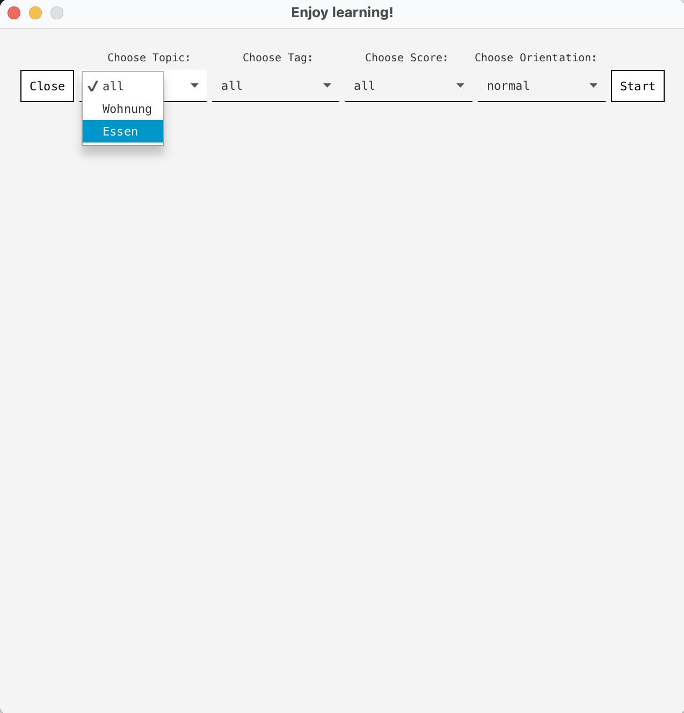
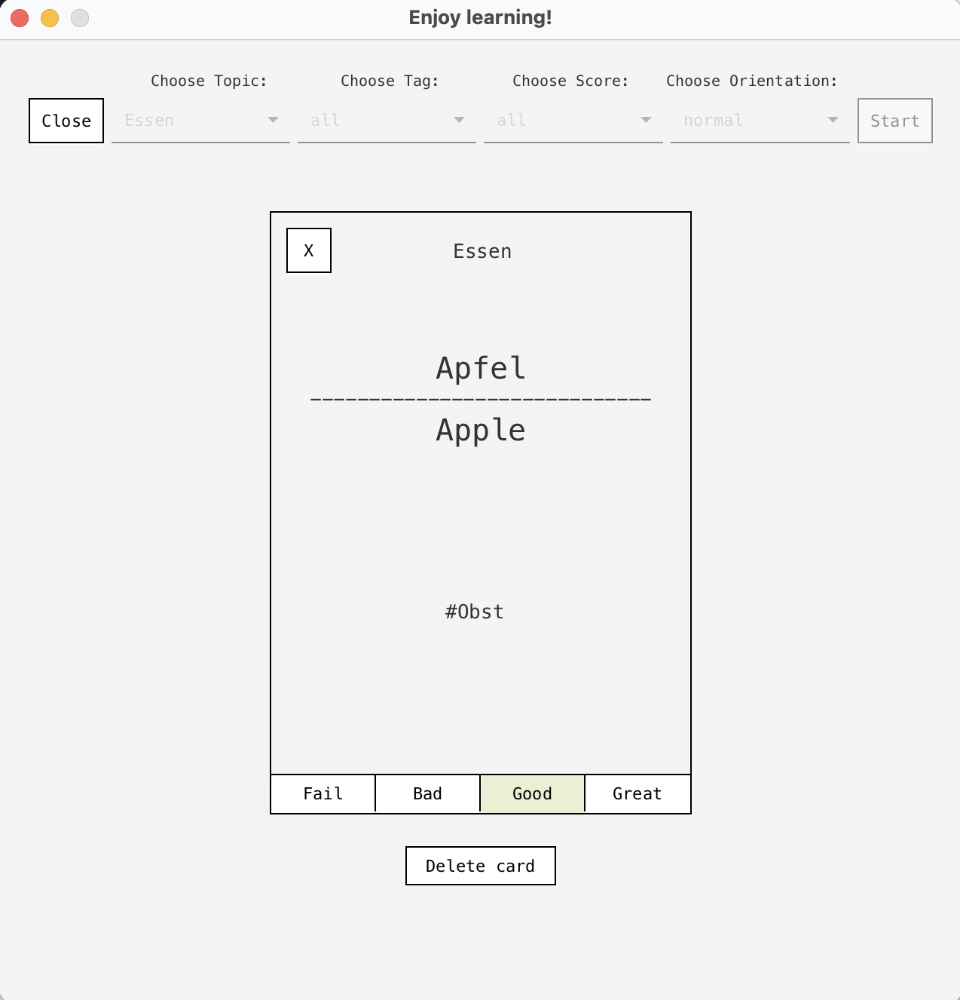
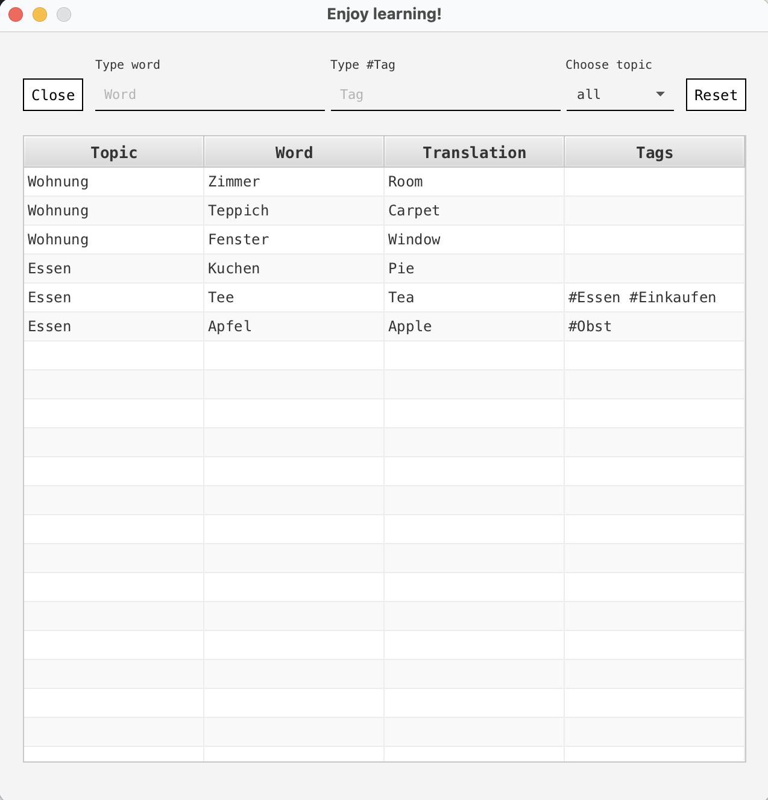
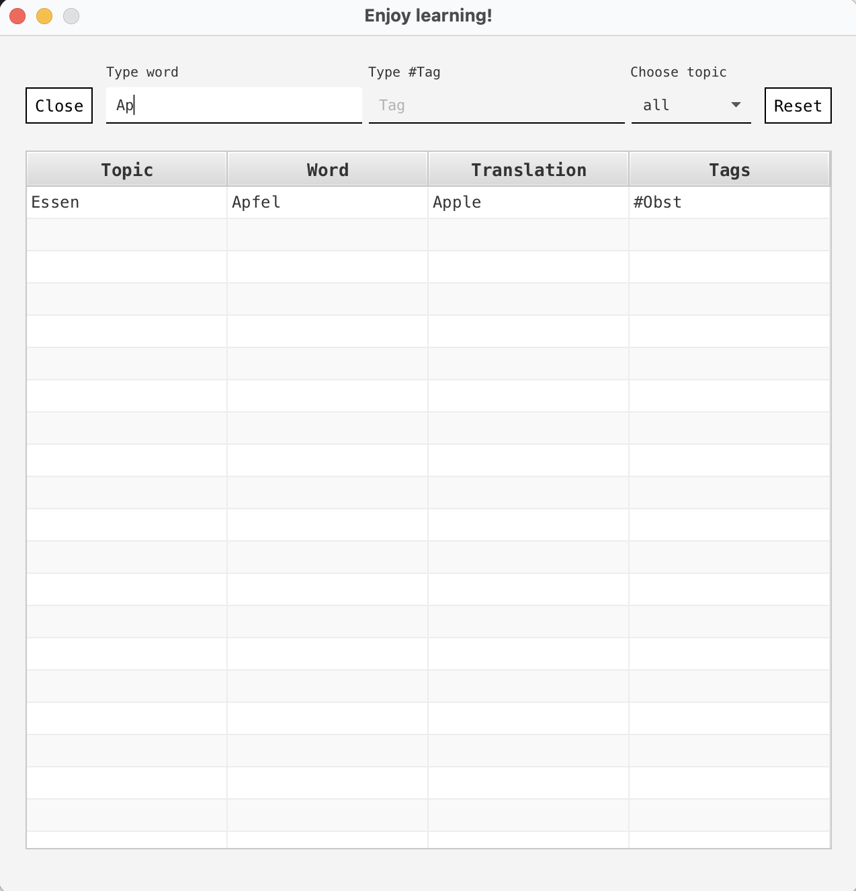

EnjoyLearning - Flashcard Learning App. 

A JavaFX desktop application for learning vocabulary with repetition and smart filtering features.  
Features. 

1. Add New Cards. 

- Create flashcards with word, translation, and custom tags. 
- Organize cards by topics/themes for easier management. 
- Flexible categorization system. 

2. Practice Mode (Repeat). 

Smart filtering options:  
  
- Filter by topic/theme. 
- Filter by tags. 
- Filter by knowledge score. 
  
Bi-directional practice: German → English or English → German. 

Self-assessment system with 4 levels:
- Fail - Don't know the word. 
- Bad - Struggling to recall. 
- Good - Know it well. 
- Great - Know it perfectly. 
  
Knowledge score automatically updates based on your assessment. 
Delete cards during practice if needed. 
  
3. Search & Browse. 
  
View all cards in a table format. 
Filter by topic or tag. 
Search for specific words. 
Quickly find relevant vocabulary (e.g., filter "Einkaufen" theme before going shopping). 
  
Technologies.
- Java
- JavaFX 
- FXML 
- Maven 
  
Installation & Running. 
Clone the repository. 
git clone https://lv-gitlab.intern.th-ab.de/s240797/enjoylearning.git. 

run application - EnjoyLearningApplication - entry point   
  
- Java 23 SDK. 
- JavaFX SDK 17+. 
- Maven. 
  

Screenshots. 
- Main view 
- Add card view 
- Add card view - validation 
- Add card view - save 
- Repeat view 
- Repeat view - score 
- Search view 
- Search view - filter 

  
Future Improvements. 
  
Spaced repetition algorithm. 
Statistics and progress tracking. 
Export/import card decks. 
Audio pronunciation. 
  
License
MIT License